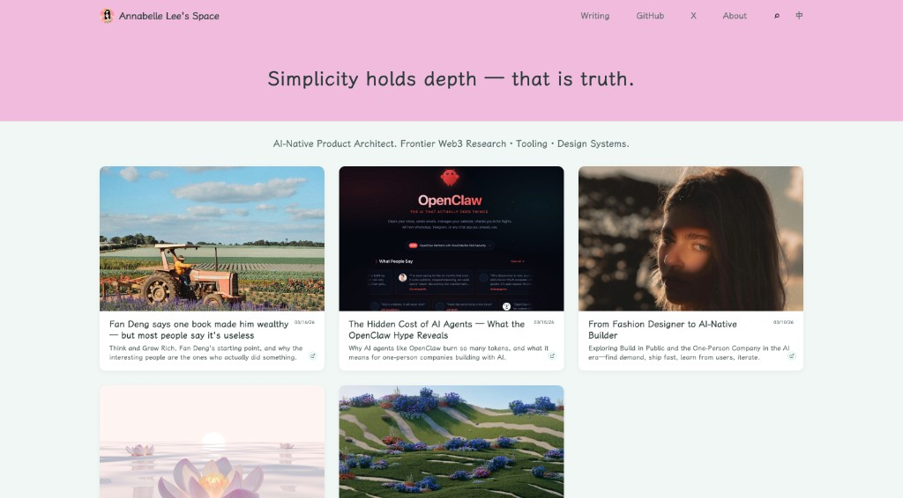

# Annabelle Lee's Space

> *Simplicity holds depth — that is truth.*

This is my personal journal. A place where I think out loud, explore ideas, and turn research into something I can hold onto. What starts here often finds its way to other platforms — but here is where it begins: raw, honest, and mine.



---

## What lives here

I write about **AI-native product building**, **Web3 frontier research**, **design systems**, and the messy middle of figuring things out. Not polished takes for algorithms — these are the notes I actually use: frameworks, experiments, and reflections that shape how I work and what I build.

If you've landed here from X, GitHub, or somewhere else — welcome. You're seeing the source.

---

## Explore

**[→ Visit the blog](https://funghi88.github.io)**

---

## Local preview

Uses Ruby 3.3 with Bundler 4.0. First-time setup:

```bash
rbenv install 3.3.10
rbenv local 3.3.10
gem install bundler:4.0.3
bundle install
```

Then:

```bash
./serve.sh
```

Open [http://localhost:4003](http://localhost:4003)

## Deploy

Push to `main`. GitHub Actions builds and deploys to Pages.

**First-time setup:** Repo Settings → Pages → Build and deployment → Source: **GitHub Actions**

```bash
git add .
git commit -m "Your commit message"
git push origin main
```
